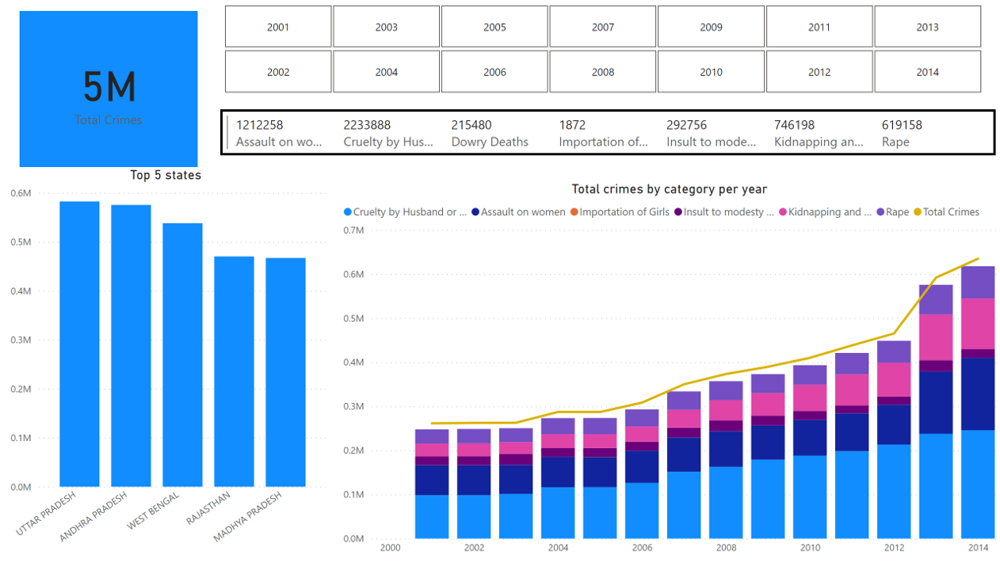
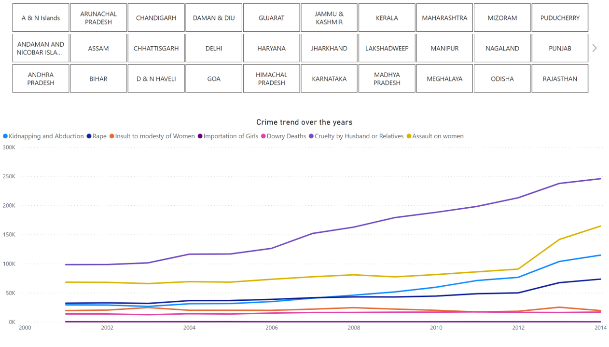

<!DOCTYPE html>
<html lang="en">
<head>
  <meta charset="UTF-8">
  <meta name="viewport" content="width=device-width, initial-scale=1.0">
</head>
<body>

  <h1>Crimes Against Women Analysis</h1>

  <h2>Project Overview</h2>

  
This project aims to provide a comprehensive analysis of crimes against women in India from 2001 to 2014. The primary objective was to understand the frequency and types of crimes reported across different states and districts during this period.

  <h2>Technologies Used</h2>

  <ul>
    <li><strong>SQL:</strong> Utilized for addressing fundamental queries and ensuring the ACID properties of the dataset.</li>
    <li><strong>Power BI:</strong> Employed to develop an interactive dashboard, revealing key insights derived from the underlying data.</li>
  </ul>

  <h2>Insights from the Dashboard</h2>

  <ol>
    <li><strong>Overall Crime Statistics (2001-2014):</strong> A total of 5 million crimes against women were reported during the period.</li>
    <li><strong>Top 5 States with Highest Crime Reports:</strong> Uttar Pradesh (UP), Madhya Pradesh (MP), Andhra Pradesh (AP), West Bengal, and Rajasthan emerged as the states with the highest reported crimes.</li>
    <li><strong>Peak Year for Crimes (2014):</strong> The year 2014 witnessed the highest number of reported crimes against women.</li>
    <li><strong>Most Common Crime Category:</strong> Cruelty by husbands or relatives was the most frequently reported category.</li>
    <li><strong>Crime Trend Over the Years:</strong> The analysis reveals a general increase in the overall crime trend from 2001 to 2014.</li>
  </ol>
  <h2>Power BI Dashboard</h2>

  
Below is a snapshot of the Power BI Dashboard:

  
  

  <h2>Conclusion</h2>

  
This project provides valuable insights into the patterns and trends of crimes against women in India over a specified timeframe. The combination of SQL for rigorous analysis and Power BI for visualization ensures a comprehensive understanding of the dataset. Feel free to explore the provided resources to delve deeper into the findings.

</body>
</html>
